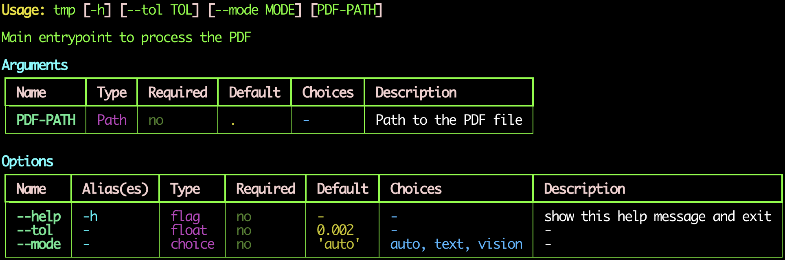

<p align="center">
  <a href="https://rogerthomas.github.io/yeetr/">
    
  </a>
</p>
<p align="center">
  <em>yeetr, build tiny CLIs. Easy to code. Based on Python type hints.</em>
</p>
<p align="center">
  <a href="https://github.com/RogerThomas/yeetr/actions/workflows/main.yml?query=branch%3Amain">
    
  </a>
  <a href="https://github.com/RogerThomas/yeetr/releases">
    
  </a>
  <a href="https://pypi.org/project/yeetr">
    
  </a>
  <a href="https://github.com/RogerThomas/yeetr/blob/main/LICENSE">
    
  </a>
</p>

# yeetr

A tiny, typed, signature-driven CLI runner.

PyPI distribution: `yeetr`
Python import package: `yeetr`
CLI command: `yeet`

> No decorators.
> No command classes.
> No ceremony.
> Just yeet the function.

---

## Getting Started

### Zero-boilerplate: just yeet it

Installing `yeetr` also installs a `yeet` script that finds and runs a
function in any Python file.

No `if __name__ == "__main__"` block, no `yeetr.run(...)` call — just
the function:

```python
# app.py
def main(thing: int, *, n: float = 0.1) -> None:
    print(thing, n)
```

```bash
yeet app.py 5 --n 0.2
```

If `app.py` does not exist yet, `yeet` will scaffold a runnable Python
script for you, mark it executable, and print the created path. Run the
same command a second time, or call `./app.py` directly, and it will
execute normally.

The default function name is `main`. Pass a different one to pick another
top-level function in the same file:

```python
# app.py
def main(...) -> None: ...
def greet(name: str, *, loud: bool = False) -> None: ...
```

```bash
yeet app.py greet world --loud
```

`yeet app.py --help` prints the **target function's** help, not yeet's.
`yeet` itself only has `yeet FILE [FUNC] [args...]`.

You can still use the explicit `yeetr.run(main)` form when you prefer —
the `yeet` script is just sugar on top of it.

### Explicit `yeetr.run(main)`

```python
def main(thing: int, *, n: float = 0.1) -> None:
    print(thing, n)


if __name__ == "__main__":
    import yeetr
    yeetr.run(main)
```

```bash
yeet app.py 5 --n 0.2
```

Note the bare `*` in the signature: parameters **before** it become
positional CLI args, parameters **after** it become `--options`. That's
the whole mapping — no decorators, no per-parameter annotations needed.

---

## Async Support

`yeetr` supports async functions natively. Just make your `main` an `async def` and `yeet`
will run it with `asyncio.run` or `uvloop.run` if [uvloop](https://github.com/MagicStack/uvloop)
is installed.

### Async

```python
async def main(name: str, *, loud: bool = False) -> None:
    ...
```

```bash
yeet app.py world --loud
```

If the function is a coroutine, its result is awaited via `asyncio.run`,
or via [`uvloop.run`](https://github.com/MagicStack/uvloop) when the
optional `uvloop` extra is installed:

```bash
uv add "yeetr[uvloop]"
```

When `uvloop` is importable, yeetr uses it transparently — no code
change required. Otherwise it falls back to the stdlib event loop.

---

## Script Execution

### Hashbang

For tiny scripts, you can make the file itself executable and let `yeet`
discover `main` directly from the shebang. The short forms are:

```python
#!yeet
```

or:

```python
#!uv run yeet
```

For example:

```python
#!yeet

def main(name: str, *, loud: bool = False) -> None:
    print(name.upper() if loud else name)
```

Then run it directly:

```bash
chmod +x greet.py
./greet.py world --loud
```

If you need a different entry function, keep the shebang simple and call
`uv run yeet app.py other_func ...` explicitly instead.

---

## Supported Parameter Types

### Path

```python
from pathlib import Path


def main(path: Path, *, output: Path | None = None) -> None:
    ...
```

```bash
yeet app.py input.pdf --output out.txt
```

---

### Literal choices

```python
from typing import Literal


def main(*, format: Literal["json", "csv"] = "json") -> None:
    ...
```

```bash
yeet app.py --format csv
```

---

## Parameter Metadata

### `Arg` and `Opt`

For aliases and help text, use `Arg` (positional) or `Opt` (keyword-only)
inside `Annotated`:

```python
from pathlib import Path
from typing import Annotated
from yeetr import Arg, Opt


def main(
    path: Annotated[Path, Arg(help="Input file")],
    *,
    workers: Annotated[int, Opt(alias="-w", help="Worker count")] = 4,
) -> None:
    ...
```

```bash
yeet app.py input.pdf -w 8
```

`Arg` accepts `help`, `metavar`, `min`, and the path validators below. `Opt`
accepts `alias`, `aliases`, `help`, `metavar`, `envvar`, `hidden`, and the
path validators below. Mixing them (e.g. `Opt` on a positional or `Arg` on a
keyword-only parameter) raises a clear `YeetrError`.

You can also define aliases once and reuse them:

```python
from pathlib import Path
from typing import Annotated
from yeetr import Arg, Opt


type InputPath = Annotated[Path, Arg(help="Input file")]
type WorkerCount = Annotated[int, Opt(alias="-w", help="Worker count")]


def main(path: InputPath, *, workers: WorkerCount = 4) -> None:
    ...
```

---

### Environment variable fallback (`Opt(envvar=...)`)

`Opt(envvar="NAME")` falls back to an environment variable when the flag is
not provided on the CLI. Precedence: **explicit CLI > env var > default**.

```python
from typing import Annotated
from yeetr import Opt


def main(*, workers: Annotated[int, Opt(envvar="WORKERS")] = 4) -> None:
    ...
```

```bash
WORKERS=8 yeet app.py         # workers == 8
yeet app.py --workers 16      # workers == 16 (CLI wins)
yeet app.py                   # workers == 4  (default)
```

Env-var values are type-coerced just like CLI values. `bool` accepts
`1/0/true/false/yes/no` (case-insensitive). `list[T]` splits on `os.pathsep`
(`:` on POSIX, `;` on Windows). `Literal` choices are validated.

---

### Hidden options (`Opt(hidden=True)`)

Hidden options still parse from the CLI but are absent from `--help` (both
the usage line and the options table):

```python
from typing import Annotated
from yeetr import Opt


def main(*, debug: Annotated[bool, Opt(hidden=True)] = False) -> None:
    ...
```

---

### Path validators

`Arg` and `Opt` accept `exists`, `file_okay`, `dir_okay`, `readable`, and
`writable` for `Path` parameters. They run at parse time and fail with a
clear error:

```python
from pathlib import Path
from typing import Annotated
from yeetr import Arg


def main(
    src: Annotated[Path, Arg(exists=True, dir_okay=False, readable=True)],
    dst: Annotated[Path, Arg(writable=True)],
) -> None:
    ...
```

Defaults mirror typer: `file_okay=True`, `dir_okay=True`, others off.
Setting any path-check on a non-`Path` parameter raises `YeetrError` at
parser-build time. Validators also apply to `list[Path]` and to
`*paths: Path`.

---

### Variadic positional args (`*args`)

`*args` maps to a trailing variadic positional CLI argument. The annotation
on `*args` is the **element type** (not `list[T]`):

```python
from pathlib import Path


def main(dst: Path, *sources: Path) -> None:
    ...
```

```bash
yeet app.py dst src1 src2 src3
```

By default `*args` accepts zero or more values (argparse `nargs="*"`). Use
`Arg(min=1)` to require at least one:

```python
from typing import Annotated
from yeetr import Arg


def main(*sources: Annotated[Path, Arg(min=1, help="Source paths")]) -> None:
    ...
```

Keyword-only options remain `--flags` after `*args`. `**kwargs` is not
supported.

**Why `Annotated`?** Python's type system only permits call expressions
(`Opt(...)`) inside the metadata slot of `Annotated`. No other syntax is
accepted by Pyright in strict mode. The `Annotated` form is verbose but is
the only way to attach per-parameter metadata that fully type-checks.

---

## CLI Rules

- **Positional** parameters become positional CLI args.
- **Keyword-only** parameters (after `*`) become `--options`.
- Names convert from `snake_case` to `kebab-case` for CLI flags.
- `flag: bool = False` becomes `--flag`.
- `flag: bool = True` becomes `--no-flag`.
- Required `bool` parameters raise a clear error.
- `T | None` / `Optional[T]` are accepted; treated as their inner type with
  `None` as default.
- `list[T]` becomes a repeated option (`--tag a --tag b`).

---

## Supported Primitives

`str`, `int`, `float`, `bool`, `pathlib.Path`, `typing.Literal[...]`,
`T | None`, `list[T]`. Anything else raises a clear `YeetrError`.

---

## Runtime Behavior

### Logging

By default, `yeetr.run` installs a Rich-based logging handler before
invoking your function, so you get formatted logs with zero boilerplate:

```python
import logging

import yeetr

logger = logging.getLogger("app")


def main(thing: int) -> None:
    logger.info("thing = %s", thing)
```

If your function has a `log_level` parameter (e.g.
`log_level: Literal["debug", "info", "warning", "error"] = "info"`), its
value drives the log level. Otherwise, the default is `INFO`.

Setup is idempotent: if the root logger already has handlers, yeetr does
not touch them. To take full control of logging yourself, opt out:

```python
yeetr.run(main, should_setup_logging=False)
```

---

### Testing

`run()` accepts an explicit `argv` for tests:

```python
yeetr.run(main, argv=["5", "--n", "0.2"])
```

---

## Help And Error Messages

On `--help` or a CLI parse error, yeetr renders the target function's
arguments and options in the same readable Rich table layout.

For example, this script:

```python
#!yeet
from logging import getLogger
from pathlib import Path
from typing import Annotated, Literal

from yeetr import Arg

logger = getLogger("Tmp")

type PDFPathArg = Annotated[Path, Arg(help="Path to the PDF file")]


def main(
    pdf_path: PDFPathArg = Path("./"),
    *,
    tol: float = 0.002,
    mode: Literal["auto", "text", "vision"] = "auto",
) -> None:
    """Main entrypoint to process the PDF"""
    logger.info(f"Processing PDF at: {pdf_path}, tol: {tol}, mode: {mode}")
```

produces help like this:

<p align="center">
  
</p>

---

## Comparison

### yeetr vs. typer

[Typer](https://github.com/fastapi/typer) is a mature, feature-rich CLI
framework and a direct inspiration for yeetr — the `Annotated[..., Arg/Opt]`
metadata pattern, path validators, and envvar fallback all take cues from
typer. yeetr is a much smaller library aimed at a narrower slice of the
problem. Quick honest comparison so you can pick the right tool:

| Topic                      | yeetr                                                                 | typer                                                              |
| -------------------------- | ---------------------------------------------------------------------- | ------------------------------------------------------------------ |
| Style                      | Plain function signature, no decorators                                | Decorators (`@app.command()`) or `typer.run`                       |
| Zero-boilerplate runner    | `yeet main.py [func] [args...]` script — no `if __name__ == "__main__"` / `yeetr.run(...)` block needed | Always need a `typer.run(...)` call or a decorated `@app.command()` entry point |
| Executable shebang         | `#!yeet` or `#!uv run yeet` can make the script itself executable without extra wrapper code | No equivalent single-line signature-driven runner; still need a `typer.run(...)` or app entry point |
| Arg vs. option mapping     | Uses Python's `*` separator: before `*` = positional args, after `*` = `--options` (no per-param annotation needed) | Decide per parameter via `typer.Argument(...)` / `typer.Option(...)` |
| Per-param metadata         | `Annotated[T, Arg(...)]` / `Annotated[T, Opt(...)]`                    | `Annotated[T, typer.Argument(...)]` / `typer.Option(...)`          |
| Variadic positional args   | Native `*args: T` maps to a trailing variadic positional arg           | Use `list[T]` with `typer.Argument(...)`                           |
| Boolean flags              | Default drives the flag: `= False` -> `--flag`, `= True` -> `--no-flag` | Pair of flags declared explicitly: `--flag / --no-flag`            |
| Subcommands                | Not supported (single command per script)                              | First-class subcommands, command groups, nested apps               |
| Async functions            | Native: `async def` is run via `asyncio.run` / `uvloop.run`            | Not built-in; wrap with `asyncio.run(...)` yourself                |
| Shell completion           | Not built-in                                                           | Built-in (bash/zsh/fish/PowerShell)                                |
| Help rendering             | Rich tables for args and options                                       | Rich-formatted help via `rich`                                     |
| Type-checker friendliness  | Designed to be Pyright-strict clean end-to-end                         | Some patterns require `# type: ignore` under strict settings       |
| Logging                    | Rich logging set up by default (opt-out)                               | Not opinionated about logging                                      |
| Dependencies               | `rich`, `rich-argparse` (small footprint)                              | `click`, `rich`, `shellingham`, `typing-extensions`                |
| Maturity / ecosystem       | New and small                                                          | Widely adopted, large ecosystem                                    |
| Best for                   | Single-purpose scripts and tools where the function *is* the CLI       | Multi-command CLIs, distributed apps, anything needing completion  |

If you need subcommands or shell completion, use typer. If you want one
function = one CLI with minimal ceremony and strict typing, yeetr is
designed for that.

---

## Project Operations

### Releases

`yeetr` uses CalVer based on the release date. Versions are published in
PEP 440 canonical form as `YYYY.M.D`, so a release on 2026-05-21 is
`2026.5.21`; multiple releases on the same day use `.postN`, for example
`2026.5.21.post1`.

Run `task release` to create the `release/{TAG}` PR, then merge it.
Then create and push the matching release tag. GitHub Actions validates
the tag, creates the GitHub Release, and a separate workflow deploys
docs.

If you need to bypass the PR flow, run `task release-direct`. That bumps
the version on `main`, runs `task deps-lock`, commits, pushes `main`,
creates the matching tag, and pushes the tag.

To bump a release version manually, run `uv version <version>`.

Install from PyPI with:

```bash
uv add yeetr
```
