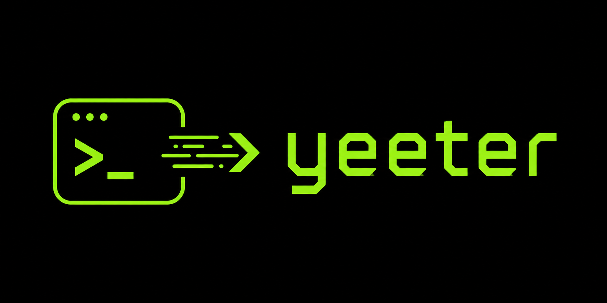

# Overview

<p align="center">
  
</p>

`yeeter` is a tiny, typed, signature-driven CLI runner.

> No decorators.
> No command classes.
> No ceremony.
> Just yeet the function.

## What it does

It turns a Python function signature into a CLI:

- positional parameters become positional CLI args
- keyword-only parameters become `--options`
- annotations drive type conversion and help text

## Minimal example

```python
from yeeter import run


def main(name: str, *, loud: bool = False) -> None:
    ...


run(main)
```

## Start Here

- Read the main project README for the full usage guide and examples.
- Check the API reference for `run`, `Param`, and `YeeterError`.
